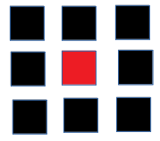
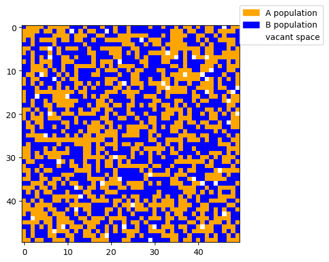
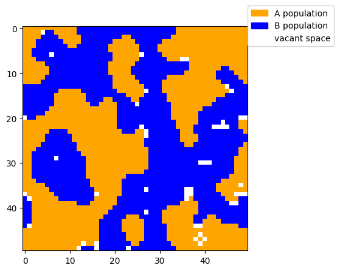
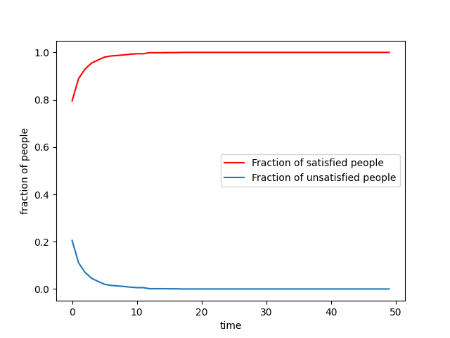

# Tessellate-2020
#Schelling's model of Segregation

This is a implementaation of [Schelling model of Segragation](https://en.wikipedia.org/wiki/Schelling%27s_model_of_segregation).

We all love to be at our homes but have you ever why our parents or grandparents choose to live where they live? If you give it a thought then you will realise they probably choose to live in that area because of some kind of similarity with neighbours(religion , ethinicity etc).  During one of the survey in major US metropolitan area, black residents were asked if they preferred to live in all-black, all-white or half-black/half-white areas, around 55% of people those surveyed stated preference for half-black/half white neighbourhoods. However, the census data reveals very small percent of black individuals(5%) in US metropolitan areas actually live in half-black/half-white neighbourhoods[1]. This was quite puzzeling until Schelling came up with a model for residential segregation. One of the earliest work in understanding the residential dynamics was given by Thomas C. Schelling in 1978[2].  Schelling’s model illustrates how  mild individual preferance regarding selectivity in neighbours can lead to segregation among population. 

Lets try to understand the original Schelling model of segregation of social segregation. Consider, two different types(say A and B) of people living in a regular suquare lattice. The individuals aims to reside within a neighbourhood where fraction of “friends” or “similar type of individual” is sufficiently high, above a predefined threshold value (H).  Let me give you an example, Suppose an individual(red) lives around the center of square lattice such that it will have eight neighbours(in black) around him as shown below .

Given the threshold for being happy=0.5, the individual is happy if half of his neighbours(4) are of his type and it will not change its position. If he is unhappy, then it will move to some other empty spot unless and until he satisfies himself. 
Here, I first considered a square grid of 105X105. This square grid has density of occupation(here d=0.98). It means 98% of grid are occupied with population and rest grid are empty spaces where unhappy people can move if required. In initial setting, the population is randomly spread through out the grid as shown below .

Now, each individual is checked if his fraction for being happy(here its 0.5) is fulfilled or not, if any individual is unhappy then he randomly goes to empty spot somewhere and leaves a vacant space behind. All the individuals are updates according to this simple rule. And after each updation we see that number of people who are happy increases and number of people who are unhappy decreases. Subsequently, A pattern of segregation emerges in the square grid where we can see the clusters of similar individuals living around each other. .

.

Relevance of Schelling model of segregation

This model demonstrates that even mild in-group preference towards their own group can lead to segregation in society.  For equal sized population, If individual preference towards their own group  is more than or equal to 1/3(Hseg)  even then groups segregate themselves. An interesting aspect of this model tells that even if the individuals are tolerant(i.e happy with half of the neighbours of their type) even then also these segregation patterns emerges out. Given that residential segregation was widespread in American cities prior to civil rights movement, the Schelling model demonstrates that  a mere imporvement in individual preferences and lack of housing discrimination are not sufficient to eliminate residential segregation. 
Despite the simplicity of the model, the large scale effects of individual preferences was remarkable. In recent studies, modellers are trying to create a more ‘realistic’ Schelling-type model which could take into account other socio-economic factors.  Schelling model’s justification for residential segregation model has been widely accepted throughout social sciences. This simple model for examining critical points in social interaction have generated great deal of research. Moreover, there have been emperical studies as social scientists wished to confirm his claims. One of such study was led by W.A.V Clarke in 1991 who used demographic surveys to examine elements of local racial preference in residential segregation. While the results did differen from Schelling, but the influence of local racial preference was strong thus confirming Schelling’s most important claims.  The lack of complexity in his model made it more infleuntial making replication and expansion of his results much easier for research community. 

[1] Davis, J. A., & Smith, T. W. (1999). General social surveys, 1972-1998: Cumulative codebook.
Chicago: National Opinion Research Center.
[2]Schelling, T. C. (1978). Micromotives and macrobehavior. New York/London: W. W. Norton.
Article reference:[Schelling’s Model: A Success for Simplicity](https://link.springer.com/chapter/10.1007/978-3-319-72408-9_7)

